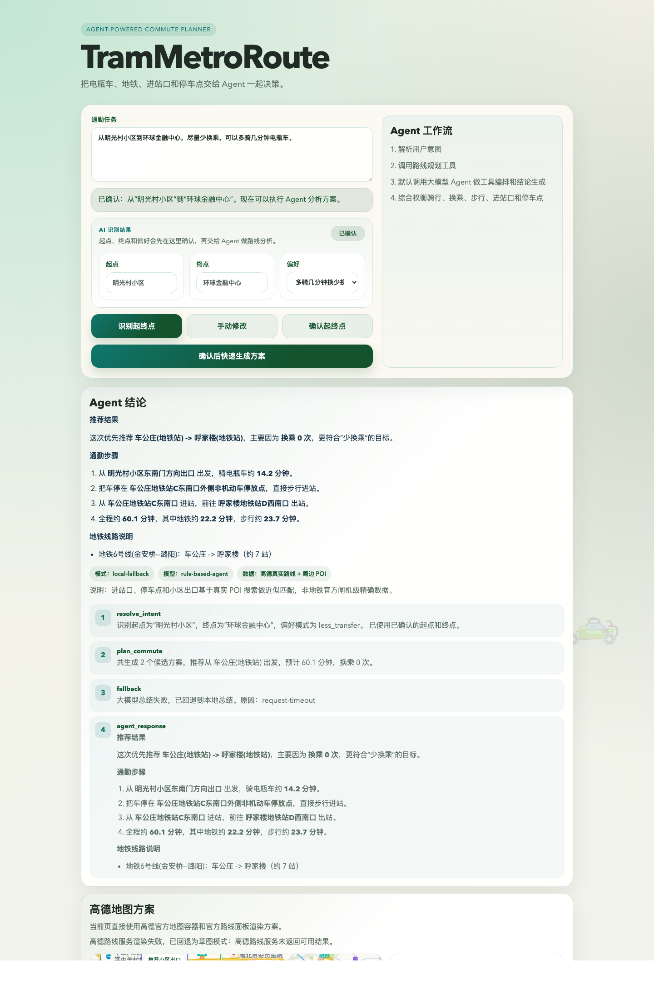

# TramMetroRoute

[中文](#中文说明) | [English](#english)



## 中文说明

基于大模型、LangGraph 和高德地图 API 的电瓶车 + 地铁联合通勤规划项目。

当前代码库已经具备这些核心能力：

- 自然语言输入通勤任务
- 大模型识别起点、终点和偏好
- 用户确认起终点后再执行 Agent 规划
- LangGraph 编排 `intent -> planning -> summary`
- 高德真实数据优先，失败时自动回退到 mock
- 前端使用高德 Web SDK 渲染地图和路线
- 生成适合展示的 Agent 结论、执行步骤和候选方案

### 项目亮点

- 支持类似 `从明光村小区到环球金融中心，尽量少换乘，可以多骑几分钟电瓶车` 的中文输入
- 默认远程 Agent 模式，远程不可用时自动回退本地总结
- 主链路使用大模型识别意图，不再只依赖正则
- 支持电瓶车骑行、地铁线路、进站口、停车点的联合推荐
- 支持 `/?demo=1` 文档演示模式，方便自动截图和 README 展示

### 产品流程

1. 用户输入通勤任务
2. 系统调用大模型识别起点、终点和偏好
3. 用户确认识别结果
4. LangGraph Agent 调用规划器
5. 规划器优先使用高德真实数据
6. 页面展示推荐方案、Agent 结论和地图路线

### 技术栈

- Node.js 18+
- 原生 `http` 服务
- 原生 HTML / CSS / JavaScript
- `@langchain/langgraph`
- OpenAI-compatible / Anthropic-compatible 模型接口
- 高德 Web Service API
- 高德 JavaScript API

### 目录结构

```text
.
├── public
│   ├── app.js
│   ├── index.html
│   └── styles.css
├── src
│   ├── config.js
│   ├── loadEnv.js
│   ├── server.js
│   ├── data
│   │   └── mockNetwork.js
│   └── services
│       ├── agent.js
│       ├── agentLangGraph.js
│       ├── amapClient.js
│       ├── amapPlanner.js
│       ├── intent.js
│       ├── intentResolver.js
│       ├── mockPlanner.js
│       └── planner.js
├── docs-homepage.png
├── .env.example
├── package.json
└── README.md
```

### 核心模块

#### 前端

- `public/index.html`：页面结构
- `public/app.js`：表单交互、Markdown 渲染、地图渲染、demo 模式
- `public/styles.css`：整体视觉、按钮层级、响应式样式、背景动效

#### 服务端

- `src/server.js`：静态资源服务和 API 路由
- `src/loadEnv.js`：读取项目根目录 `.env`

#### Agent 层

- `src/services/agent.js`：当前 Agent 入口导出
- `src/services/agentLangGraph.js`：LangGraph 工作流、远程总结、本地 fallback
- `src/services/intentResolver.js`：大模型识别起点、终点和偏好
- `src/services/intent.js`：规则兜底解析

#### 规划层

- `src/services/planner.js`：统一规划入口、缓存、Amap/mock 切换
- `src/services/amapPlanner.js`：高德真实规划
- `src/services/mockPlanner.js`：mock 兜底规划
- `src/config.js`：评分权重、候选搜索数量、速度配置

### 快速开始

#### 1. 安装依赖

```bash
npm install
```

#### 2. 创建本地环境变量

```bash
cp .env.example .env
```

#### 3. 配置模型和高德 Key

最少需要补这些配置：

```env
AGENT_PROVIDER=anthropic
AGENT_EXECUTION_MODE=remote
AGENT_API_KEY=your_agent_api_key
AGENT_BASE_URL=https://your-anthropic-compatible-endpoint.example.com/api/anthropic
AGENT_MODEL=MiniMax-M2.5

AMAP_WEB_SERVICE_KEY=your_amap_web_service_key
AMAP_JS_API_KEY=your_amap_js_api_key
```

#### 4. 申请高德开发者 Key

本项目需要两个高德 Key：

- `AMAP_WEB_SERVICE_KEY`
  用于服务端地理编码、公交/地铁规划、骑行规划、POI 搜索
- `AMAP_JS_API_KEY`
  用于前端高德地图 SDK 和路线渲染

官方入口：

- 高德开放平台：[https://lbs.amap.com/](https://lbs.amap.com/)
- 高德控制台 / 我的应用：[https://console.amap.com/dev/key/app](https://console.amap.com/dev/key/app)

建议的配置方式：

1. 登录高德开放平台
2. 创建一个应用
3. 新增一个 `Web服务` Key 给后端使用
4. 新增一个 `Web端(JSAPI)` Key 给前端使用
5. 将两个 Key 填入本地 `.env`

#### 5. 启动项目

```bash
npm start
```

启动后访问：

- 本地首页：[http://localhost:3060](http://localhost:3060)
- 文档演示模式：[http://localhost:3060/?demo=1](http://localhost:3060/?demo=1)

### 可用脚本

```bash
npm start
npm run check
```

- `npm start`：启动本地服务
- `npm run check`：检查服务端入口语法

### 环境变量说明

完整模板见 [`.env.example`](./.env.example)。

#### Agent 相关

- `AGENT_PROVIDER`
- `AGENT_EXECUTION_MODE`
- `AGENT_API_KEY`
- `AGENT_BASE_URL`
- `AGENT_MODEL`
- `AGENT_HTTP_TIMEOUT_MS`

#### Anthropic-compatible 别名

- `ANTHROPIC_API_KEY`
- `ANTHROPIC_AUTH_TOKEN`
- `ANTHROPIC_BASE_URL`
- `ANTHROPIC_MODEL`

#### OpenAI-compatible 别名

- `OPENAI_API_KEY`
- `OPENAI_BASE_URL`
- `OPENAI_MODEL`
- `LLM_API_KEY`
- `LLM_BASE_URL`
- `LLM_MODEL`

#### 高德相关

- `AMAP_WEB_SERVICE_KEY`
- `AMAP_JS_API_KEY`

### API

#### `GET /api/health`

返回当前服务状态、Agent 模式和规划器模式。

示例返回：

```json
{
  "status": "ok",
  "service": "TramMetroRoute Planner API",
  "agent": {
    "mode": "remote-agent",
    "provider": "anthropic",
    "model": "MiniMax-M2.5"
  },
  "planner": {
    "mode": "amap-real",
    "enabled": true
  }
}
```

#### `GET /api/runtime-config`

返回前端运行时配置，例如高德 JS Key。

#### `POST /api/resolve-intent`

从自然语言中识别起点、终点和偏好。

示例请求：

```json
{
  "query": "我在明光村小区去环球金融中心，尽量少换乘，可以多骑几分钟电瓶车。",
  "preference": "多骑几分钟，少换乘"
}
```

#### `POST /api/plan`

直接返回规划结果，不包含 Agent 解释。

#### `POST /api/agent-plan`

执行完整 Agent 流程，返回：

- `agent.mode`
- `agent.provider`
- `agent.model`
- `agent.message`
- `agent.steps`
- `planning.summary`
- `planning.plans`

### 工作原理

#### 意图识别

`src/services/intentResolver.js` 调用远程模型识别：

- `origin`
- `destination`
- `mode`
- `preferLongerRide`

识别结果带有缓存，并在失败时回退到 `src/services/intent.js`。

#### Agent 编排

`src/services/agentLangGraph.js` 里的 LangGraph 流程大致是：

```text
START
 ├─ use_confirmed_intent
 └─ resolve_intent
      ↓
  plan_commute
      ↓
  remote_summary / local_summary
      ↓
     END
```

#### 规划器

`src/services/planner.js` 会根据当前配置选择：

- `src/services/amapPlanner.js`
- `src/services/mockPlanner.js`

并处理：

- 规划缓存
- 并发中的请求去重
- fallback 元数据

#### 高德真实规划

`src/services/amapPlanner.js` 组合了这些能力：

- 地址地理编码
- 公交/地铁候选路线
- 电瓶车骑行路径估算
- 周边地铁站搜索
- 进站口与停车点推荐
- 按偏好进行打分和排序

### 当前限制

- 高德不直接提供完整的站内导航数据，因此进站口和停车点仍是近似推荐
- 远程模型和高德接口都会影响整体等待时间
- 上游失败时系统会回退，不会阻塞页面，但结果可能退化为本地总结或 mock 数据
- 当前仍是单页原型，前端尚未拆成组件化工程

### 后续优化方向

- 提升地铁口和非机动车停车点匹配精度
- 继续压缩远程 Agent 的整体耗时
- 加强缓存、日志和稳定性
- 增加更多城市和更多偏好策略
- 为规划打分和意图识别补自动化测试

### License

当前仓库还没有单独的 license 文件。

---

## English

TramMetroRoute is an AI-powered ebike + subway commute planner built with LLM intent parsing, LangGraph orchestration, and AMap APIs.

### Highlights

- Natural-language commute input
- LLM-based origin/destination/preference extraction
- Confirm-before-plan interaction flow
- LangGraph agent workflow
- AMap-first real planning with mock fallback
- AMap Web SDK route rendering
- Demo mode for documentation screenshots

### Quick Start

```bash
npm install
cp .env.example .env
npm start
```

Open:

- [http://localhost:3060](http://localhost:3060)
- [http://localhost:3060/?demo=1](http://localhost:3060/?demo=1)

### Required Keys

This project needs:

- `AMAP_WEB_SERVICE_KEY`
- `AMAP_JS_API_KEY`
- model provider credentials such as `AGENT_API_KEY`

AMap developer links:

- AMap Open Platform: [https://lbs.amap.com/](https://lbs.amap.com/)
- AMap Console: [https://console.amap.com/dev/key/app](https://console.amap.com/dev/key/app)

### Main Files

- `src/server.js`
- `src/services/agentLangGraph.js`
- `src/services/intentResolver.js`
- `src/services/planner.js`
- `src/services/amapPlanner.js`
- `public/app.js`

### API

- `GET /api/health`
- `GET /api/runtime-config`
- `POST /api/resolve-intent`
- `POST /api/plan`
- `POST /api/agent-plan`
